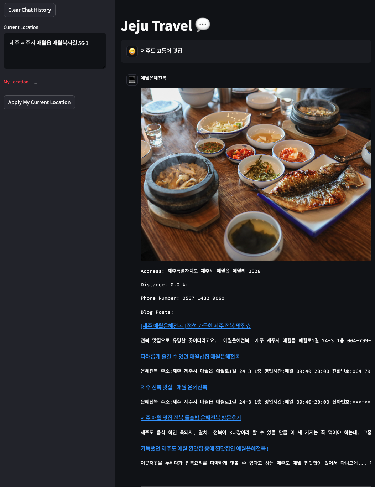
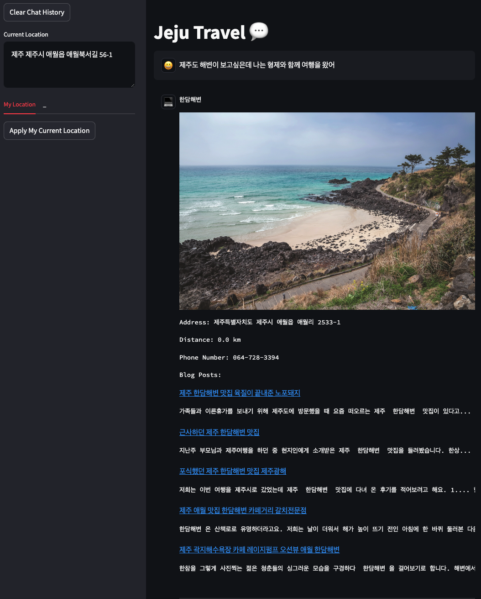
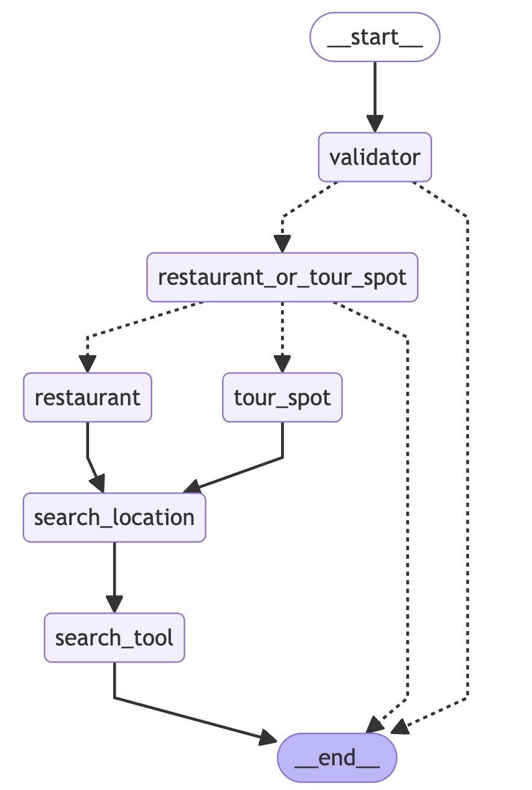

# Demo

## LangChain Architecture

## Requirements

- Use [Naver Maps API](https://api.ncloud-docs.com/docs/ai-naver-mapsgeocoding-geocode) for current geolocation
- Get Application Key from [ncloud](https://console.ncloud.com/dashboard)
    - Should set NAVER_MAP_CLIENT_ID, NAVER_MAP_CLIENT_SECRET in `.env` file
- Use [Naver Blog Search API](https://developers.naver.com/docs/serviceapi/search/blog/blog.md)
- Get Application Key from [naver Developers](https://developers.naver.com/apps/#/list)
    - Should set NAVER_SEARCH_CLIENT_ID, NAVER_SEARCH_CLIENT_SECRET in `.env` file
- `pip install -r requirements.txt`

## Data

- `visit_jeju_csv_restaurant.csv`: jeju restaurants
- `visit_jeju_csv_tour_spot.csv`: jeju tour spots
